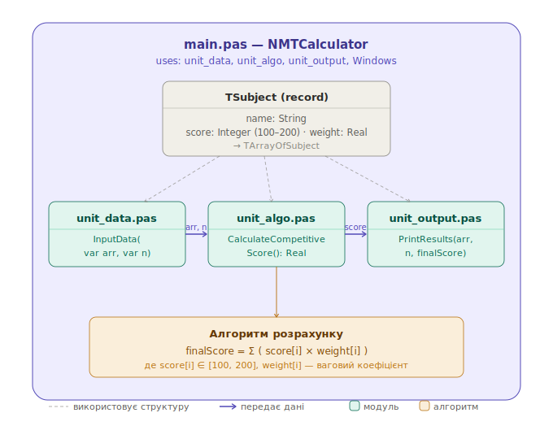

# Калькулятор балів НМТ

Програма для розрахунку конкурсного бала вступника на основі результатів Національного мультипредметного тесту (НМТ) та вагових коефіцієнтів спеціальності.

## Функції програми
1) Введення даних:
   Користувач вводить бали (100–200) та вагові коефіцієнти
   для 4 предметів НМТ. Є валідація — якщо бал виходить за
   межі або коефіцієнт <= 0, програма просить ввести повторно.
 
2) Обчислення конкурсного балу:
   Розраховується зважена середня: кожен бал множиться на
   свій коефіцієнт, результати підсумовуються і діляться
   на суму всіх коефіцієнтів.
 
3) Вивід результатів:
   Форматований вивід таблиці предметів з балами та
   коефіцієнтами, і підсумкового конкурсного балу.
   
## Структура даних
- Дані зберігаються В ОПЕРАТИВНіЙ ПАМ'ЯТІ (під час роботи).
- Структура: масив записів TArrayOfSubject (розмір = 4).
- Кожен запис TSubject має поля:
    Name: String — назва предмета
    Score: Integer — бал (100–200)
    Coefficient: Real — ваговий коефіцієнт
- Після завершення програми дані НЕ зберігаються
  (немає запису у файл чи базу даних).

## Модулі та їх контракти
- `unit_data.pas` – введення даних та їх зберігання.
  - `procedure InputData(var arr: TArrayOfSubject; var n: Integer);`
- `unit_algo.pas` – обчислення конкурсного бала.
  - `function CalculateCompetitiveScore(arr: TArrayOfSubject; n: Integer): Real;`
- `unit_output.pas` – форматований вивід результатів.
  - `procedure PrintResults(arr: TArrayOfSubject; n: Integer; finalScore: Real);`

## Розподіл ролей
- **Тімлід**: unit_algo.pas (алгоритм обчислення)
- **Розробник 1**: unit_data.pas (введення даних)
- **Розробник 2**: main.pas (головна програма та інтеграція)
- **Розробник 3**: unit_output.pas (вивід результату)
- **Документатор**: README.md, diagram.drawio
